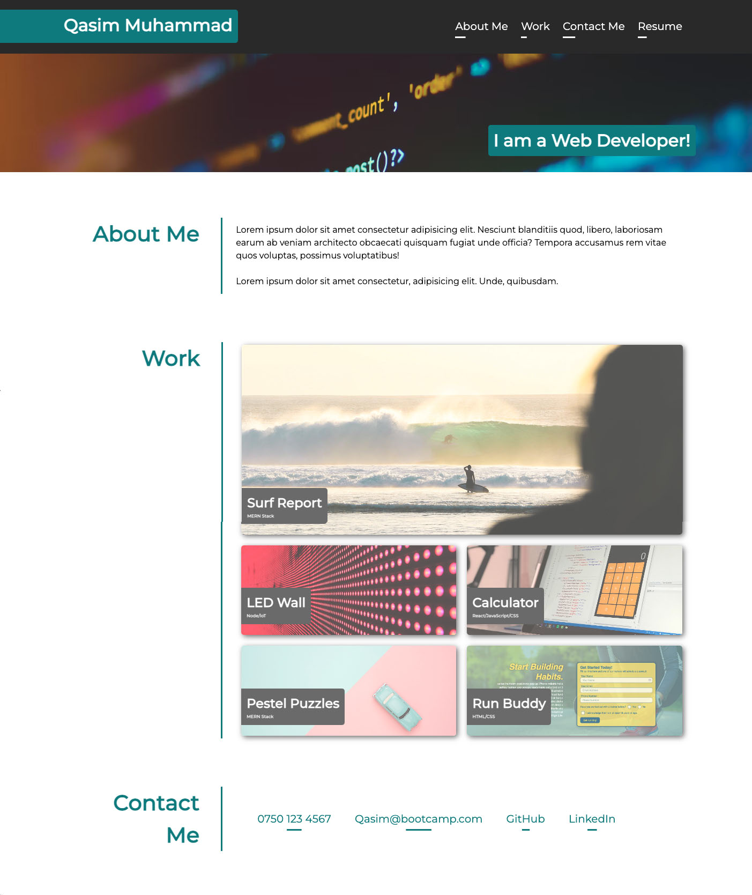

# ResponsivePortfolioChallenge-Challenge-2

## Project Description:
This is 2nd week challenge building a responsive portfolio with placeholder text and images

## Approach:
Approach was simple HTML first and CSS after. As I was building HTML, it was in my mind how I will tackle in CSS. So HTML part gave me clear idea how I will
target classes. In the CSS section I started from top to bottom and keep targeting one by one attributes and classes.

# HTML:
HTML was the stepping stone of my website and I planned all the sections and parts in HTML to keep CSS simple. 
I linked google fonts and CSS style sheet to HTML so I can use Montesserat font for better look and feel.

# CSS:
CSS was made simple by HTML. I kept picking one by one classes and attributes and keep styling as we go. And things started shaping up nicely. I knew I am going to differenciate CSS by section, Navbar, Header, Work sample and footer. So it was much easier to target. 

# Responsiveness and Media Queries:

As per brief I had to make the website interactive and responsive. So added media queries at for breaking point of 1000px and 500px to make it compatible with all screen size and devices.

# Techenologies:
This project was built with HTML and CSS.

## Deploy:
I deploy this website by using GitHub commands (Git Clone, git add., git push). And shared a live link for review.

## License:
I have added a MIT license. This is free website and anyone can use it.

# Screenshot

Screenshot is only for reference. 

